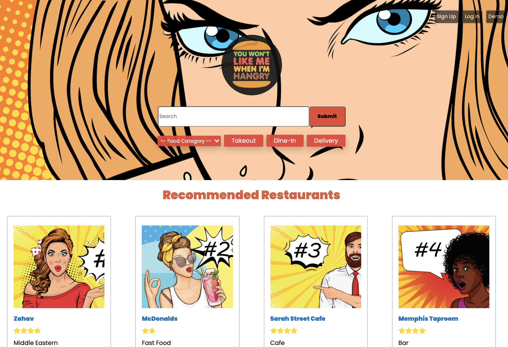
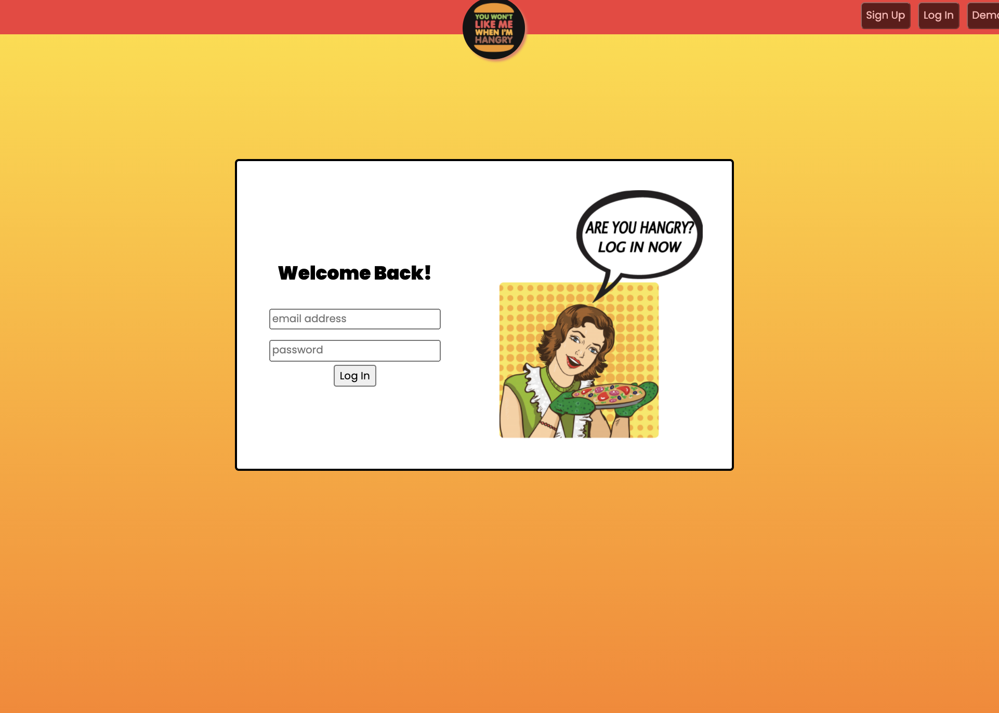
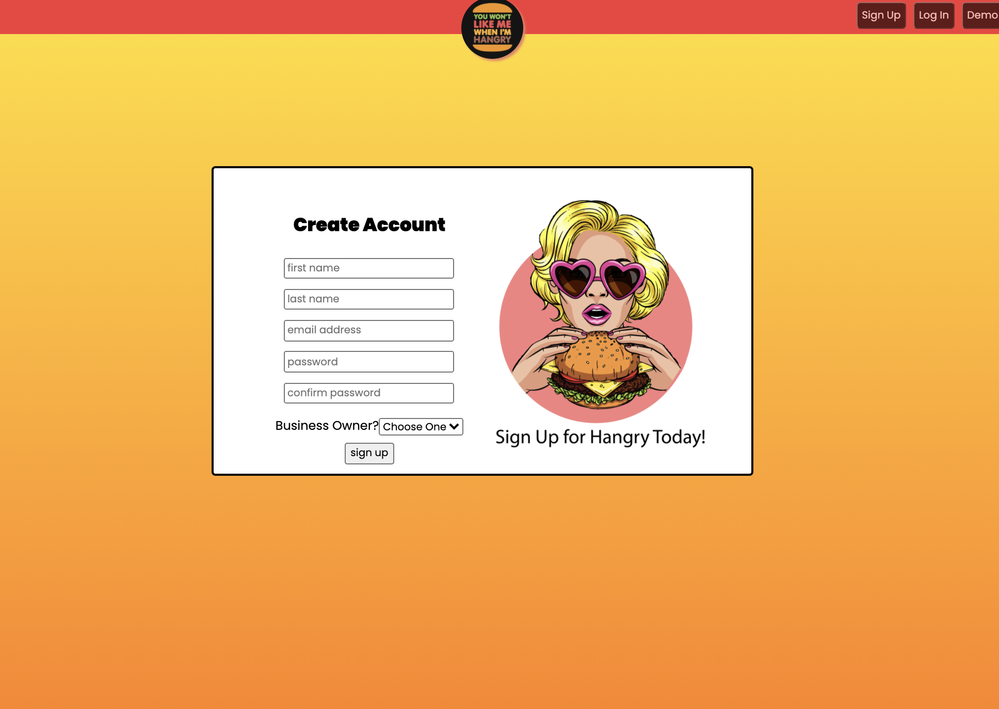
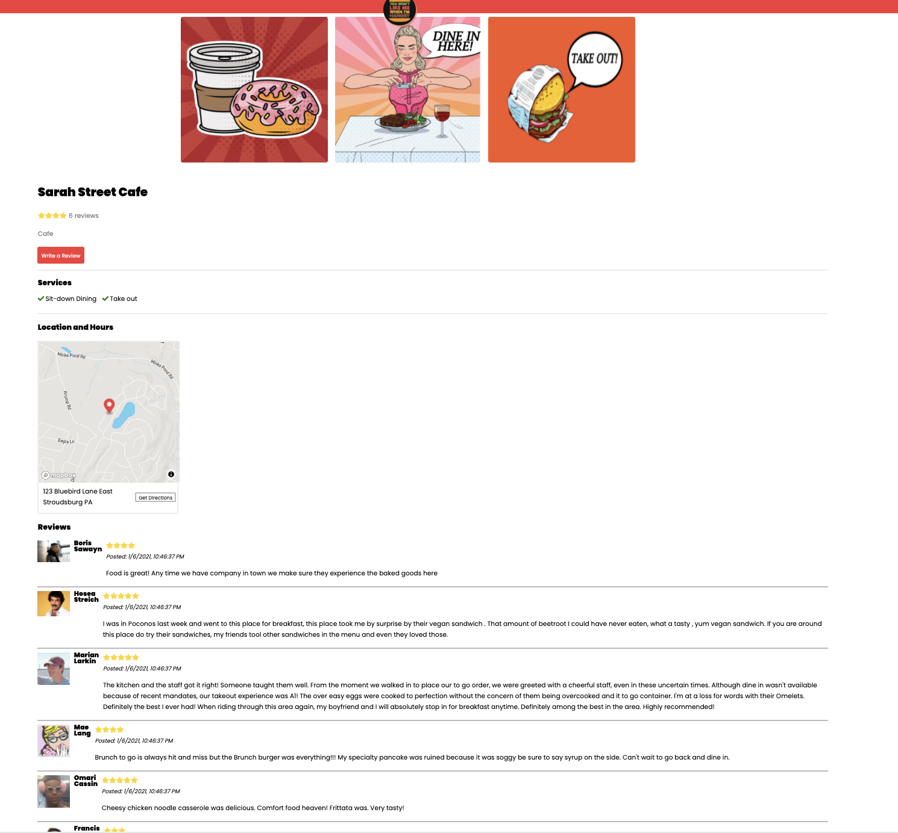
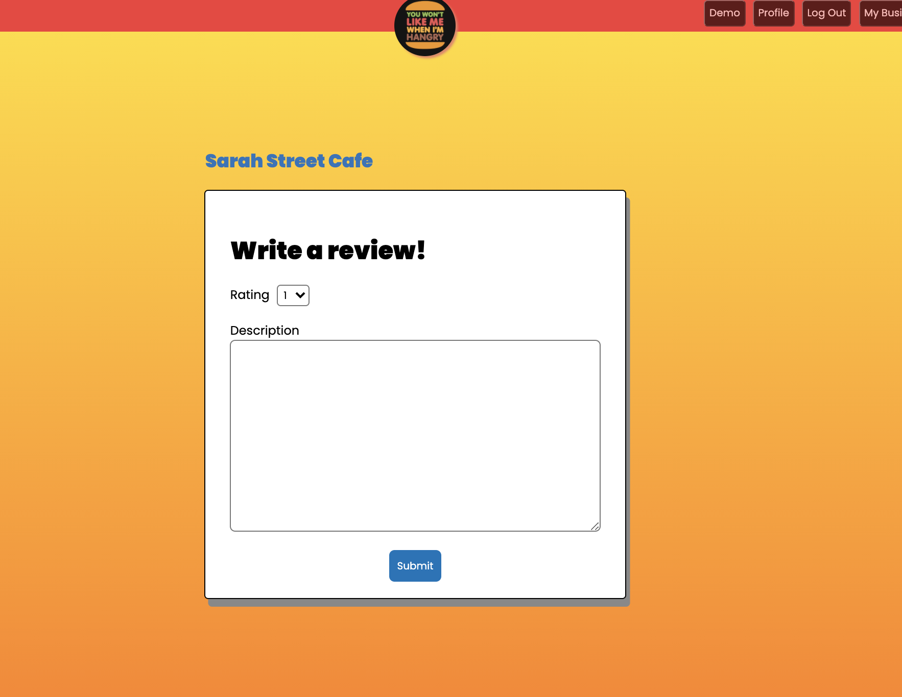
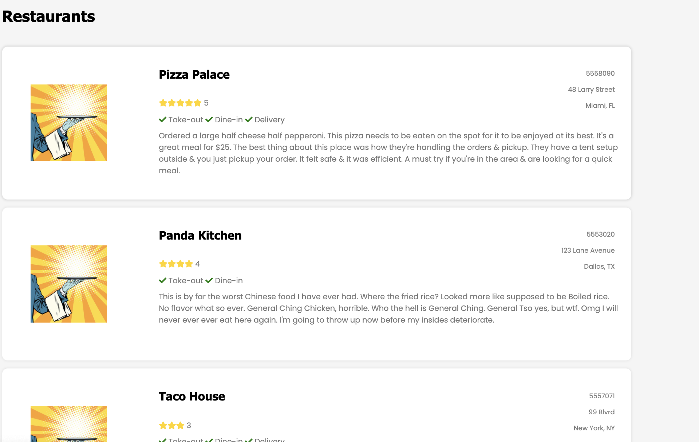
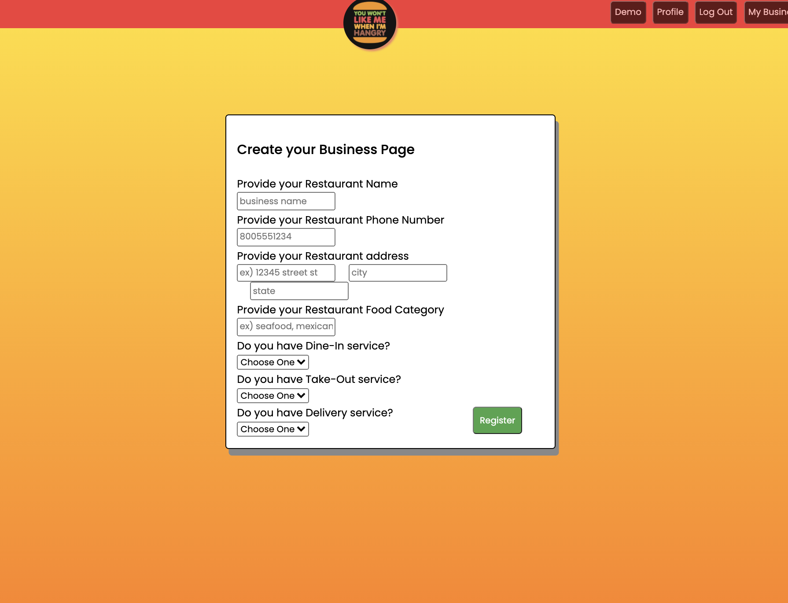
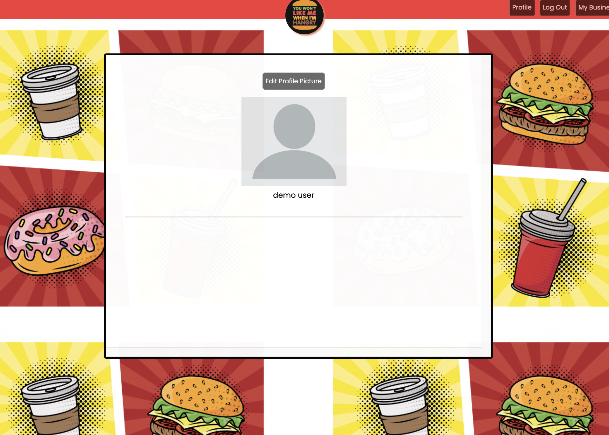
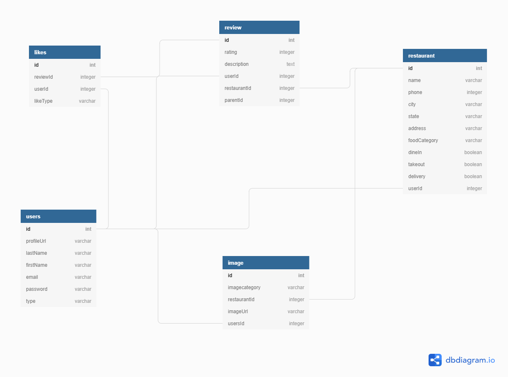

[![Wren McPherson][linkedin-shield]][linkedin-url-wren] Wren McPherson
<br>
[![Peter Kang][linkedin-shield]][linkedin-url-peter] Peter Kang
<br>
[![Ranson Knorr][linkedin-shield]][linkedin-url-ranson] Ranson Knorr
<br>
[![Ryan Young][linkedin-shield]][linkedin-url-ryan] Ryan Young
<br>
![Akmal Anvarov][linkedin-shield] Akmal Anvarov

[Live Site](https://hangry-yelp-clone.herokuapp.com/)

<!-- PROJECT LOGO -->
<br />
<p align="center">
<a href="https://hangry-yelp-clone.herokuapp.com/">
    </a>
<a href="https://hangry-yelp-clone.herokuapp.com/">
  <h3 align="center">Hangry</h3></a>
  


</p>


<!-- TABLE OF CONTENTS -->
<details open="open">
  <summary><h2 style="display: inline-block">Table of Contents</h2></summary>
  <ol>
    <li>
      <a href="#about-the-project">About The Project</a>
      <ul>
        <li><a href="#technical-stack">Technical Stack</a></li>
        <li><a href="#introduction">Introduction</a></li>
        <li><a href="#mvp">MVP</a></li>
      </ul>
    </li>
    <li>
      <a href="#getting-started">Getting Started</a>
      <ul>
        <li><a href="#prerequisites">Prerequisites</a></li>
        <li><a href="#installation">Installation</a></li>
      </ul>
    </li>
    <li><a href="#usage">Usage</a></li>
    <li><a href="#api-frontend">API Frontend</a></li>
    <li><a href="#api-backend">API Backend</a></li>
  </ol>
</details>


<!-- ABOUT THE PROJECT -->
## About The Project
*Pop art Splash page with restaurants.


*User can Login with their account.


*User can signup as non business owner or business owner.


*User can explore business page with google map and reviews.


*Only logged in user can leave reviews for businesses.


*All users can search for businesses.


*Business owner user can create business.


*User can change their avatar picture and see all the reviews.


*Database Schema



### Technical Stack

* Frontend built with JavaScript, Node.js and Pug.js.
* Backend built with Express and Sequelize.


### introduction

Are you Hangry? Hangry is a One-stop hub for restaurants and consumers inspired by Yelp.


### MVP
the MVP for this website encompasses the following:

1.  Login/Sign-up
    1. Users can login as a demo account.
    2. Users can create account in sign-up page.
2.  Main Page
    1. Shows restaurants with star ratings.
    2. Search bar where user can select food categories and service types.
3. Business
    1. Show the detail of the business including rating, type of food/business, location and reviews.
    2. User can click on the map to get directions to the business.
4. Review
    1. Shows all reviews associated with the business.
    2. User can leave a review with rating.
    


<!-- GETTING STARTED -->
## Getting Started
-----------

To get a local copy up and running follow these simple steps.

### Prerequisites

Express, react, s3...

### Installation


1. Clone the repo
   ```sh
   git clone https://github.com/ransonk/group-yelp-project.git
   ```
2. Install NPM packages
   ```sh
   npm install
   ```
3. Create your postgres database and connect it to the app.

4. On the root directory to run frontend and backend
   ```sh
   npm start
   ```
5. browse to http://locahost:8080.


<!-- USAGE EXAMPLES -->
## Usage
-----------
Users can explore businesses/restaurants in this platform. They can also create an account to add their business. User can leave and view reviews.


## API Frontend
--------------------------
|    Path            |   HTTP Verb   |          Meaning                   |
|--------------------|---------------|------------------------------------|
|         /          |      GET      |       Show main page               |
|         /          |      POST     |      search restaurants            |
|       /log-in      |      GET      |      Show a log-in form            |
|       /log-in      |      POST     |         logs in user               |
|      /sign-up      |      GET      |      show a sign-up form           |
|      /sign-up      |      POST     |      creates a new user            |
|      /search       |      GET      |   gets list of businesses          |
|      /search       |      POST     |    searches for businesses         |
| /write-a-review/2  |      GET      |        shows review form           |
| /write-a-review/2  |     POST      |    creates a review for restaurant |
|  /restaurants/id   |      GET      |  lists the restaurant and its info |
|      /users/id     |      GET      |        shows uer info              |

--------------------------

## API Backend
-----------
|                Path                 | HTTP Verb |                      Meaning                           |
|-------------------------------------|-----------|--------------------------------------------------------|
| /api/users/token                    |   POST    |                   logs in user                         |
| /api/users                          |   POST    |                   logs in user                         |
| /api/users/id                       |   GET     |            gets user for user profile                  |
| /api/users/check                    |   POST    |            check if user is logged in                  |
| /api/users/image/edit               |   PATCH   |             edit user's profile image                  |
| /api/restaurants/                   |   POST    |      user lists their restaurant (create new)          |
| /api/restaurants/id                 |   GET     |          gets all specific restaurant data             |
| /api/restaurants/id                 |   DELETE  |              remove specific restaurant                |
| /api/restaurants/id/reviews         |   POST    |           create new review for restaurant             |
| /api/restaurants/id/reviews         |   DELETE  |     delete specific review if current user made it     |
| /api/restaurants/id/reviews         |   PUT     |           edit review if current user made it          |
| /api/restaurants/user/id/restaurant |   GET     |           gets specific restaurant by user ID          |
| /api/search/name/query              |   GET     |     gets restaurants that match the search query       |
| /api/search/dropdown/category       |   GET     | gets restaurants that match the selected food category |
| /api/search/services/type           |   GET     | gets restaurants that match the selected services type |


[linkedin-shield]: https://img.shields.io/badge/-LinkedIn-black.svg?style=for-the-badge&logo=linkedin&colorB=555
[linkedin-url-peter]: https://www.linkedin.com/in/peter-kang-129184166/
[linkedin-url-ranson]:https://www.linkedin.com/in/ranson-knorr-b132391b7/
[linkedin-url-wren]:https://www.linkedin.com/in/wren-mcpherson-415223bb/
[linkedin-url-ryan]:https://www.linkedin.com/in/ryan-young-b67a7aab/
